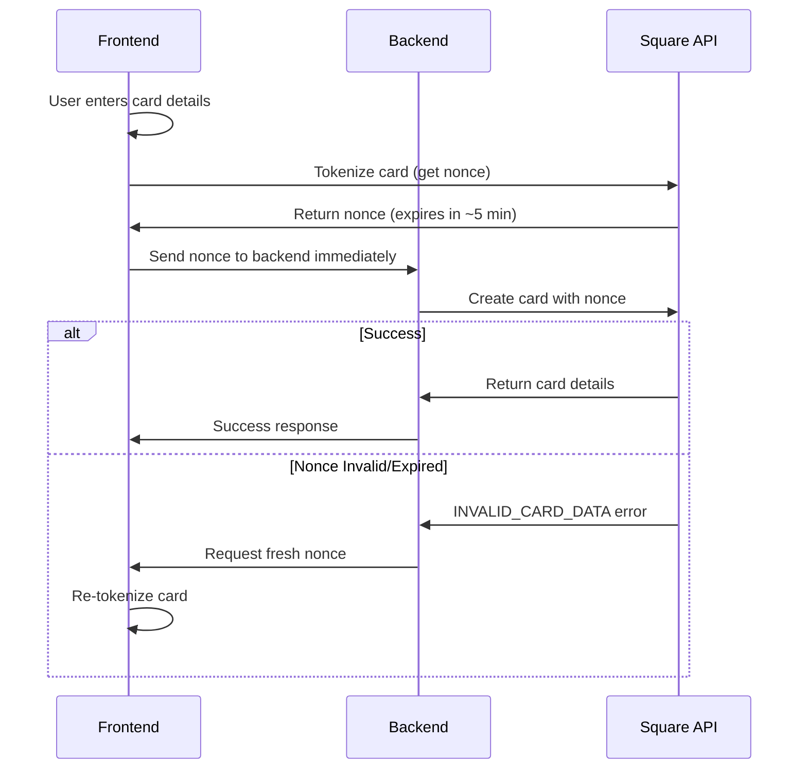

# Square Payment Nonce Guide

## What is a Payment Nonce?

A payment nonce is a secure, single-use token that represents payment method data (like a credit card) that has been tokenized by Square's frontend SDK. It's used to safely transmit payment information from the frontend to your backend without exposing sensitive card data.

## Key Characteristics

### ⏰ **Short Expiration Time**
- Nonces expire after **a few minutes** (typically 5-10 minutes)
- Always generate fresh nonces for each transaction

### 🔒 **Single-Use Only**
- Each nonce can only be used **once**
- After successful use, the nonce becomes invalid
- Failed attempts may also consume the nonce

### 🌍 **Environment Specific**
- Sandbox nonces only work in sandbox environment
- Production nonces only work in production environment

## Nonce Formats

Square nonces have different prefixes depending on the payment method:

```
cnon:XXXXXXXXXXXXXXXXXXXXXXX        # Card nonce
sq_cnon:XXXXXXXXXXXXXXXXXXXXXXX     # Square card nonce  
tok_XXXXXXXXXXXXXXXXXXXXXXX         # Token
```

## Common Error Scenarios

### ❌ "Invalid card data" Error
```json
{
  "category": "INVALID_REQUEST_ERROR",
  "code": "INVALID_CARD_DATA", 
  "detail": "Invalid card data.",
  "field": "source_id"
}
```

**Possible Causes:**
1. **Expired nonce** - Generated more than a few minutes ago
2. **Already used nonce** - Previously consumed in another request
3. **Wrong environment** - Sandbox nonce used in production or vice versa
4. **Malformed nonce** - Corrupted during transmission

## Best Practices

### 🚀 **Frontend Implementation**
```javascript
// Generate fresh nonce right before sending to backend
const result = await card.tokenize();
if (result.status === 'OK') {
  // Immediately send to backend - don't store or reuse
  sendToBackend(result.token);
}
```

### 🔧 **Backend Implementation**
```javascript
// Use nonce immediately upon receipt
try {
  const card = await squareService.createCardOnFile(customerId, nonce);
  return card;
} catch (error) {
  if (error.code === 'INVALID_CARD_DATA') {
    // Request fresh nonce from frontend
    throw new Error('Payment method expired. Please re-enter card details.');
  }
}
```

### 🔄 **Error Handling Strategy**
1. **Detect nonce errors** - Check for `INVALID_CARD_DATA` on `source_id` field
2. **Request fresh nonce** - Ask frontend to regenerate payment method
3. **Provide clear feedback** - Tell user to re-enter card details
4. **Don't retry** - Old nonces won't work, need fresh ones

## Testing with Square Sandbox

### 📋 **Test Card Numbers**
```
Success: 4111 1111 1111 1111 (Visa)
Decline: 4000 0000 0000 0002
CVV: Any 3 digits (e.g., 123)
Expiry: Any future date (e.g., 12/25)
```

### 🧪 **Testing Nonce Expiration**
1. Generate nonce in frontend
2. Wait 10+ minutes
3. Try to use nonce - should fail with "Invalid card data"
4. Generate fresh nonce - should succeed

## Troubleshooting Checklist

When you get "Invalid card data" errors:

- [ ] Is the nonce freshly generated (< 5 minutes old)?
- [ ] Has the nonce been used before in any request?
- [ ] Are you using the correct environment (sandbox/production)?
- [ ] Is the nonce format valid (starts with expected prefix)?
- [ ] Is your Square access token valid and for the right environment?

## Integration Flow



## Summary

- **Generate nonces fresh** for each transaction
- **Use immediately** - don't store or cache nonces
- **Handle expiration gracefully** - request new nonces when needed
- **Match environments** - sandbox nonces for sandbox, production for production
- **Expect single-use** - each nonce works only once
