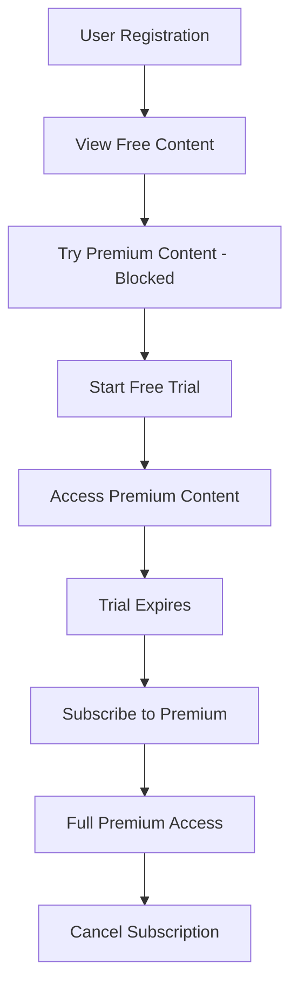

# Square Subscription Testing Guide

This guide provides step-by-step instructions to test the freemium subscription system with Square integration.

## 🔧 Prerequisites

1. **Environment Setup**: Ensure your `.env` file contains:
```bash
SQUARE_ACCESS_TOKEN=your_sandbox_access_token
SQUARE_LOCATION_ID=your_location_id
SQUARE_MONTHLY_PLAN_ID=BKWHGZNOZJ3NAYFHKK3GXWRK
SQUARE_YEARLY_PLAN_ID=CQF77RXHW5LF6T7ISZ7VWVZ3
```

2. **Server Running**: Start your server with `npm run dev`

3. **Authentication**: Have a valid user token for protected endpoints

## 📋 Testing Flow Overview



## 🧪 Test Cases

### 1. **View Subscription Plans**
Test that subscription plans are properly configured.

**Request:**
```bash
curl -X GET http://localhost:3000/api/subscriptions/plans \
  -H "Content-Type: application/json"
```

**Expected Response:**
```json
{
  "success": true,
  "data": [
    {
      "id": "BKWHGZNOZJ3NAYFHKK3GXWRK",
      "name": "Premium Monthly",
      "price": { "amount": 999, "currency": "USD" },
      "billingPeriod": "MONTHLY"
    },
    {
      "id": "CQF77RXHW5LF6T7ISZ7VWVZ3",
      "name": "Premium Yearly",
      "price": { "amount": 9999, "currency": "USD" },
      "billingPeriod": "ANNUAL"
    }
  ]
}
```

### 2. **View Free Content (Unauthenticated)**
Test that free content is accessible without authentication.

**Request:**
```bash
curl -X GET "http://localhost:3000/api/stitches?tier=free" \
  -H "Content-Type: application/json"
```

**Expected Response:**
```json
{
  "success": true,
  "data": [
    {
      "name": "Basic Stitch",
      "tier": "free",
      "subscriptionInfo": {
        "requiresPremium": false,
        "userHasAccess": true,
        "premiumFeatures": []
      }
    }
  ],
  "userSubscription": {
    "status": "free",
    "hasPremiumAccess": false
  }
}
```

### 3. **Try Premium Content (Blocked)**
Test that premium content is blocked for free users.

**Request:**
```bash
curl -X GET http://localhost:3000/api/stitches/STITCH_ID/premium-content \
  -H "Authorization: Bearer YOUR_USER_TOKEN" \
  -H "Content-Type: application/json"
```

**Expected Response:**
```json
{
  "success": false,
  "message": "Premium subscription required to access this content",
  "code": "PREMIUM_REQUIRED",
  "data": {
    "currentPlan": "free",
    "trialUsed": false,
    "hasSubscription": false,
    "subscriptionStatus": "none"
  }
}
```

### 4. **Check User Subscription Status**
Test viewing current subscription status.

**Request:**
```bash
curl -X GET http://localhost:3000/api/subscriptions/my-subscription \
  -H "Authorization: Bearer YOUR_USER_TOKEN" \
  -H "Content-Type: application/json"
```

**Expected Response (Free User):**
```json
{
  "success": true,
  "data": {
    "planType": "free",
    "status": "inactive",
    "hasPremiumAccess": false
  }
}
```

### 5. **Start Free Trial**
Test starting a 7-day free trial.

**Request:**
```bash
curl -X POST http://localhost:3000/api/subscriptions/start-trial \
  -H "Authorization: Bearer YOUR_USER_TOKEN" \
  -H "Content-Type: application/json" \
  -d '{
    "trialDays": 7
  }'
```

**Expected Response:**
```json
{
  "success": true,
  "data": {
    "user": {
      "subscriptionStatus": "trial",
      "premiumAccessUntil": "2025-10-11T07:23:18.000Z",
      "trialUsed": true
    },
    "subscription": {
      "planType": "free",
      "status": "active",
      "isTrialActive": true
    }
  },
  "message": "Free trial started for 7 days"
}
```

### 6. **Access Premium Content (Trial Active)**
Test accessing premium content during trial period.

**Request:**
```bash
curl -X GET http://localhost:3000/api/stitches/STITCH_ID/premium-content \
  -H "Authorization: Bearer YOUR_USER_TOKEN" \
  -H "Content-Type: application/json"
```

**Expected Response:**
```json
{
  "success": true,
  "message": "Premium content access granted",
  "data": {
    "highQualityImages": true,
    "videoTutorials": true,
    "detailedInstructions": true
  }
}
```

### 7. **Create Subscription (Monthly)**
Test creating a monthly subscription.

**Request:**
```bash
curl -X POST http://localhost:3000/api/subscriptions/subscribe \
  -H "Authorization: Bearer YOUR_USER_TOKEN" \
  -H "Content-Type: application/json" \
  -d '{
    "planId": "BKWHGZNOZJ3NAYFHKK3GXWRK",
    "paymentMethodId": "cnon:card-nonce-ok"
  }'
```

**Expected Response:**
```json
{
  "success": true,
  "data": {
    "userId": "USER_ID",
    "planType": "premium_monthly",
    "status": "active",
    "currentPeriodStart": "2025-10-04T07:23:18.000Z",
    "currentPeriodEnd": "2025-11-04T07:23:18.000Z",
    "amount": 999,
    "currency": "USD"
  },
  "message": "Subscription created successfully"
}
```

### 8. **View Premium Content (Subscribed)**
Test accessing all premium content with active subscription.

**Request:**
```bash
curl -X GET "http://localhost:3000/api/stitches" \
  -H "Authorization: Bearer YOUR_USER_TOKEN" \
  -H "Content-Type: application/json"
```

**Expected Response:**
```json
{
  "success": true,
  "data": [
    {
      "name": "Premium Stitch",
      "tier": "premium",
      "subscriptionInfo": {
        "requiresPremium": true,
        "userHasAccess": true,
        "premiumFeatures": ["highQualityImages", "videoTutorials"]
      }
    }
  ],
  "userSubscription": {
    "status": "premium_monthly",
    "hasPremiumAccess": true
  }
}
```

### 9. **Update Subscription (Yearly)**
Test upgrading to yearly subscription.

**Request:**
```bash
curl -X PUT http://localhost:3000/api/subscriptions/update \
  -H "Authorization: Bearer YOUR_USER_TOKEN" \
  -H "Content-Type: application/json" \
  -d '{
    "planId": "CQF77RXHW5LF6T7ISZ7VWVZ3"
  }'
```

**Expected Response:**
```json
{
  "success": true,
  "data": {
    "planType": "premium_yearly",
    "status": "active"
  },
  "message": "Subscription updated successfully"
}
```

### 10. **Cancel Subscription**
Test canceling subscription at period end.

**Request:**
```bash
curl -X POST http://localhost:3000/api/subscriptions/cancel \
  -H "Authorization: Bearer YOUR_USER_TOKEN" \
  -H "Content-Type: application/json" \
  -d '{
    "cancelAtPeriodEnd": true
  }'
```

**Expected Response:**
```json
{
  "success": true,
  "data": {
    "status": "CANCELED",
    "canceledDate": "2025-11-04"
  },
  "message": "Subscription will be cancelled at the end of the current period"
}
```

### 11. **Process One-time Payment**
Test processing a one-time payment.

**Request:**
```bash
curl -X POST http://localhost:3000/api/subscriptions/payment \
  -H "Authorization: Bearer YOUR_USER_TOKEN" \
  -H "Content-Type: application/json" \
  -d '{
    "amount": 1999,
    "currency": "USD",
    "paymentMethodId": "cnon:card-nonce-ok",
    "description": "Premium content unlock"
  }'
```

**Expected Response:**
```json
{
  "success": true,
  "data": {
    "id": "PAYMENT_ID",
    "status": "COMPLETED",
    "amountMoney": {
      "amount": 1999,
      "currency": "USD"
    }
  },
  "message": "Payment processed successfully"
}
```

### 12. **Subscription Analytics (Admin)**
Test viewing subscription analytics.

**Request:**
```bash
curl -X GET http://localhost:3000/api/subscriptions/analytics \
  -H "Authorization: Bearer ADMIN_TOKEN" \
  -H "Content-Type: application/json"
```

**Expected Response:**
```json
{
  "success": true,
  "data": {
    "planAnalytics": [
      {
        "_id": "premium_monthly",
        "count": 15,
        "totalRevenue": 14985,
        "activeSubscriptions": 12
      }
    ],
    "totalUsers": 100,
    "premiumUsers": 25,
    "conversionRate": "25.00"
  }
}
```

## 🧪 Square Sandbox Test Cards

Use these test card numbers in Square Sandbox:

### Successful Payments:
- **Visa**: `4111 1111 1111 1111`
- **Mastercard**: `5555 5555 5555 4444`
- **American Express**: `3782 822463 10005`

### Test Scenarios:
- **CVV**: `111` (any 3-digit number)
- **Expiry**: Any future date
- **Postal Code**: Any valid postal code

### Card Nonces for Testing:
- **Success**: `cnon:card-nonce-ok`
- **Decline**: `cnon:card-nonce-declined`
- **Insufficient Funds**: `cnon:card-nonce-insufficient-funds`

## 🔍 Error Testing

### Test Invalid Plan ID:
```bash
curl -X POST http://localhost:3000/api/subscriptions/subscribe \
  -H "Authorization: Bearer YOUR_USER_TOKEN" \
  -H "Content-Type: application/json" \
  -d '{
    "planId": "INVALID_PLAN_ID",
    "paymentMethodId": "cnon:card-nonce-ok"
  }'
```

### Test Duplicate Subscription:
Try creating a subscription when user already has one active.

### Test Trial Already Used:
Try starting a trial when user has already used their trial.

## 📊 Webhook Testing

To test webhooks locally, use ngrok:

1. **Install ngrok**: `npm install -g ngrok`
2. **Expose local server**: `ngrok http 3000`
3. **Configure webhook URL** in Square Dashboard: `https://your-ngrok-url.ngrok.io/api/subscriptions/webhook`

### Test Webhook Events:
- Subscription updated
- Subscription canceled
- Payment succeeded
- Payment failed

## 🚀 Postman Collection

Import this collection for easier testing:

```json
{
  "info": {
    "name": "Square Subscriptions API",
    "schema": "https://schema.getpostman.com/json/collection/v2.1.0/collection.json"
  },
  "item": [
    {
      "name": "Get Subscription Plans",
      "request": {
        "method": "GET",
        "header": [],
        "url": {
          "raw": "{{baseUrl}}/api/subscriptions/plans",
          "host": ["{{baseUrl}}"],
          "path": ["api", "subscriptions", "plans"]
        }
      }
    },
    {
      "name": "Start Free Trial",
      "request": {
        "method": "POST",
        "header": [
          {
            "key": "Authorization",
            "value": "Bearer {{userToken}}"
          },
          {
            "key": "Content-Type",
            "value": "application/json"
          }
        ],
        "body": {
          "raw": "{\n  \"trialDays\": 7\n}"
        },
        "url": {
          "raw": "{{baseUrl}}/api/subscriptions/start-trial",
          "host": ["{{baseUrl}}"],
          "path": ["api", "subscriptions", "start-trial"]
        }
      }
    }
  ],
  "variable": [
    {
      "key": "baseUrl",
      "value": "http://localhost:3000"
    },
    {
      "key": "userToken",
      "value": "your_user_token_here"
    }
  ]
}
```

## 🎯 Success Criteria

- ✅ Free users can view free content
- ✅ Premium content is blocked for free users
- ✅ Free trial grants temporary premium access
- ✅ Subscriptions provide full premium access
- ✅ Payment processing works with Square
- ✅ Subscription management (upgrade/cancel) works
- ✅ Webhooks handle subscription events
- ✅ Analytics provide business insights

## 🐛 Common Issues & Solutions

### Issue: "Authentication failed"
**Solution**: Check your `SQUARE_ACCESS_TOKEN` in `.env` file

### Issue: "Location not found"
**Solution**: Verify `SQUARE_LOCATION_ID` is correct

### Issue: "Plan not found"
**Solution**: Ensure plan IDs exist in your Square catalog

### Issue: "Payment declined"
**Solution**: Use valid test card numbers for sandbox

---

**Happy Testing! 🚀**
